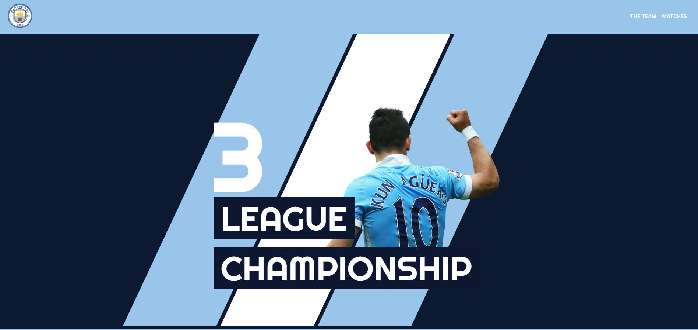

# Project #2: Creating a Manchester City Clone Website

This is part of the Udemy course [The React Practice Course: Learn by Building Projects](https://www.udemy.com/the-react-practice-course-learn-by-building-projects) by [Coding Revolution](https://www.udemy.com/user/codign-revolution/).

## Getting Started

**Demo**:\
Visit [https://m-city-75660.firebaseapp.com/](https://m-city-75660.firebaseapp.com/).

## Key Concepts Covered

1. React Development Pattern

2. Simple Animations with React

3. Firebase Database, Storage, Authentication and Deployment

## Reviews

Overall this is a pretty good project covering some good frontend development patterns, but there are some parts that may not be great for scaling apps. More importantly the pace of the course was good for even beginners and fun especially for guys that understand sport and love coding.

----
 